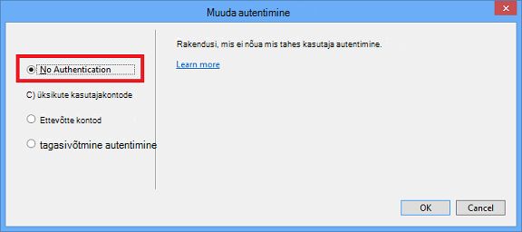

<properties
    pageTitle="Allahindlusest piltide loomine"
    description="Selgitab, kuidas luua pilti allahindlusest vastavalt juhistele Azure hoidlate seadmine."
    services=""
    solutions=""
    documentationCenter=""
    authors="kenhoff"
    manager="ilanas"
    editor="tysonn"/>

<tags
    ms.service="contributor-guide"
    ms.devlang=""
    ms.topic="article"
    ms.tgt_pltfrm=""
    ms.workload=""
    ms.date="06/25/2015"
    ms.author="kenhoff" />

# <a name="create-images-in-markdown"></a>Allahindlusest piltide loomine

## <a name="image-folder-creation-and-link-syntax"></a>Pilt kausta loomist ja link süntaks

Uus artikkel, peate luua kausta asukohtadest.

    /articles/<service-directory>/media/<article-name>/

Näiteks:

    /articles/app-service/media/app-service-enterprise-multichannel-apps/

Kui olete loonud kausta ja selle lisatud pilte, kasutage järgmist süntaksit luua pilte oma artiklis:

```

```
Näide:

Vt näide [allahindlusest Mall](../markdown%20templates/markdown-template-for-new-articles.md) .  Selle allahindlusest malli pilti viide lingid on mõeldud malli allosas.

## <a name="guidelines-specific-to-azuremicrosoftcom"></a>Juhised konkreetsete azure.microsoft.com

Kuvatõmmised praegu soovitatakse, kui see ei ole võimalik lisada repro juhiseid. Kirjutage oma sisu nii, et sisu saate vajadusel ilma ekraanipildid esile.

Pidage silmas järgmisi juhiseid loomisel ja sh pilt failid:
- Jagada art faile üle dokumendid. Kopeerige fail ja lisage see media kausta oma kindla teemaga seotud. Failide jagamine soovitatav, sest see on lihtsam eemaldada aegunud sisu ja piltide, mis hoiab repo clean.

- Failivormingud: PNG-vormingus failide - kasutamine neid kõrgema kvaliteediga ja säilitada oma kvaliteeti lokaliseerimine käigus. Muud failivormingud pole säilitada oma kvaliteeti ka. JPEG-vormingus on lubatud, kuid mitte eelistatud.  Pole animeeritud GIF-faile.

- Punane ruutude lähtutud Paint vaikelaiuse kasutamine (5 px) helistada tähelepanu teatud elemente kuvatõmmised.  

    Näide:

    

- Kui see on mõistlik, võite pilte kärpida, et Kasutajaliidese elemendid kuvatakse täissuuruses. Veenduge, et kontekstis on küll Eemalda kasutajad.

- Vältige servad kuvatõmmised tühik. Kui nii, et jätab valgel taustal servades kuvatõmmis kärpimiseks pildi ühe piksli halli Äärise lisamine.  Kui värvi, kasutage heledam Hall vaikimisi värvi pallete (0xC3C3C3). Kui mõne muu pildi rakenduse kasutamisel on värvi RGB R195 G195 195. Saate hõlpsasti lisada Hall pildi ümber ääris Visio – Selleks valige pilt, valige rida ja veenduge, et selle on seatud õige värv, ja seejärel muutke joone jämeduse pt 1 1/2.  Kuvatõmmised peaks olema 1 piksli laiune Hall ääris, et valgel alal pildil pole blur veebilehele.

    Näide:

    
    
    Tööriista abil automatiseerida nõutav Äärise lisamine piltide, leiate teemast [AddACOMBorder tööriist - automatiseerida nõutav 1 piksli halli äärist ACOM piltide lisamise kohta](https://github.com/Azure/Azure-CSI-Content-Tools/tree/master/Tools/AddACOMImageBorder).

- Kontseptuaalne pildid koos tühiku pole vaja Hall ääris.  

    Näide:

    

- Proovige teha pole liiga suur pilt.  Pildid kuvatakse automaatselt suurust muuta, kui need on liiga suur. Siiski mõnikord suuruse muutmine põhjustab segasus, seega soovitame piirata oma pilte 780 laiuse px ja käsitsi suuruse muutmise piltide enne esitamist vajaduse korral.

- Kuvatõmmised käsk väljundeid kuvada.  Kui teie artikkel sisaldab juhiseid, kui kasutaja töötab shell sees, on kasulik kuvatõmmised käsu väljund kuvamiseks. Sel juhul piiramine oma shell laius umbes 72 märkide üldiselt tagab, et teie pildi jäävad 780 px laiuse juhiste. Kuvatõmmis väljundi enne akna suuruse muutmiseks nii, et kuvatakse ainult asjakohaste käsu ja väljundi (soovi korral koos tühja rea mõlemal pool).

- Kogu kuvatõmmised windows, kui võimalik. Kuvatõmmis brauseriaknas võtmisel suurust muuta oma brauseriaknas 780 px lai või ja Säilita nii, et teie taotlus mahuks akna võimalikult lühike brauseriaknas, kui kõrgus.

    Näide:

    

- Millist teavet on ilmnenud kuvatõmmised ettevaatlik abil.  Ilmnenud sisemine ettevõtte andmete ja isikliku teabe.

- Kontseptuaalne pilt või skeemid kasutada ametlik ikoonid pilveteenuste ja ettevõtte sümbol ja ikooni määramine. Avaliku on saadaval veebisaidil http://aka.ms/CnESymbols.

- Isikliku või teavet kuvatõmmised asendada kohatäiteteksti nurga nurksulgudes. See hõlmab kasutajanimed, tellimuse ID-d ja muud andmed. Isiklike kontaktide saate asendada ka [kinnitatud fictious nimi](https://aka.ms/ficticiousnames)(ainult töötaja link). Ärge kasutage pastell või marker näpunäidet Paint segane või blur isikliku või teavet.

  Järgmisel pildil on õigesti värskendatud, asendage kohatäide tegelik **Tellimuse ID** :

  

### <a name="contributors-guide-links"></a>Osaliste juhend lingid

- [Artikli ülevaade](./../README.md)
- [Juhised artiklite register](./contributor-guide-index.md)
