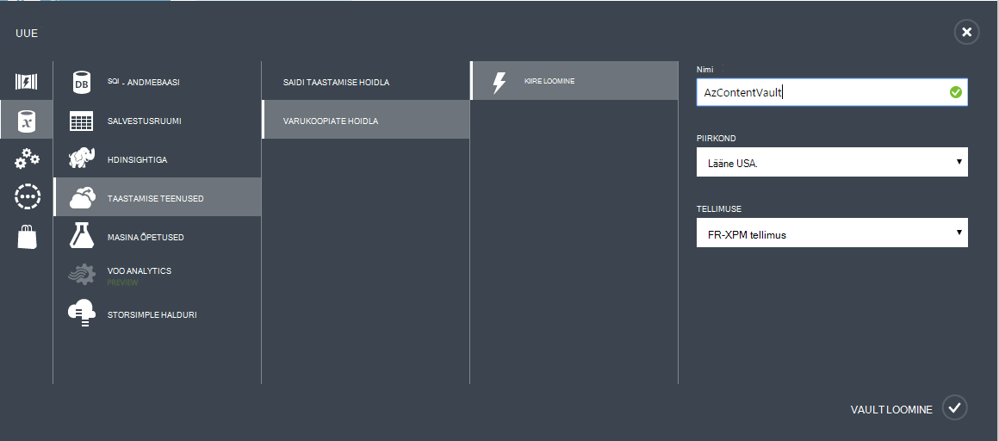

## Varukoopiate hoidla loomine
Varundage failide ja andmete Windows Server või kaitse Manager (DPM) Azure või kui varundate IaaS VMs Azure'i, peate looma varukoopiate hoidla geograafilised piirkond, kuhu soovite andmed salvestada.

Järgmised toimingud juhendab teid varukoopiate salvestamiseks vault loomine.

1. Logige sisse [haldusportaal](https://manage.windowsazure.com/)
2. Klõpsake nuppu **Uus** > **Data Services** > **Taastamise teenused** > **Varundamise Vault** ja valige **Kiiresti luua**.

    

3. Parameetri **nimi** , sisestage sõbralik nimi, mis tähistavad varukoopiate hoidla. See peab olema kordumatu iga tellimuse jaoks.

4. Valige parameeter **piirkond** geograafilised regiooni jaoks varukoopiate hoidla. Valik määrab geograafilised piirkond, millele saadetakse teie varundatud andmete. Valides Sule asukoha geograafiline piirkond, saate vähendada Võrgu latentsusaeg kui Azure varundada.

5. Klõpsake töövoo lõpuleviimiseks **Vault loomine** . Võib kuluda aega varukoopiate hoidla luua. Oleku, saate jälgida teatised portaali allosas.

    

6. Kui varukoopiate hoidla on loodud, sõnumi teade vault on loodud. Vault on loetletud ka ressursside taastamine teenuste jaoks **aktiivseks**.

    

### Azure'i varundus - koondamise talletussuvandite

>[AZURE.IMPORTANT] Valida parima aja tuvastada teie salvestusruumi koondamise suvand on kohe pärast vault loomine ja enne mis tahes masinad on registreeritud vault. Kui üksus on vault registrisse kantud, salvestusruumi koondamise suvand on lukus ja seda ei saa muuta.

Teie ettevõtte vajadustele määratlevad salvestusruumi koondamise Azure varukoopia kirjutamata salvestusruumi. Kui kasutate Azure esmane varukoopia salvestusruumi endpoint (nt varundate Azure'i Windows Server), võiksite kaaluda geograafilise liigne salvestusruumi suvandi valimisel (vaikesäte). See on näha jaotises **konfigureerimine** võimalus oma varundamise vault.

#### Geograafilise liigne salvestusruumi (GRS)
GRS säilitab andmete kuus koopiad. GRS, andmete korratakse kolm korda esmane piirkonnas ja on ka kopeeritud teisene piirkonna sadu miili eemale esmane piirkond, pakkudes kõrgeima taseme kestvus kolm korda. Esmane piirkond, talletades andmete GRS, ebaõnnestumise korral Azure varukoopia tagab, et teie andmed on püsival kahe omaette piirkondades.

#### Kohalik liigsete salvestusruumi (LRS)
Kohalik liigsete salvestusruumi (LRS) säilitab andmete kolm eksemplari. LRS korratakse kolm korda ühe poole ühe piirkonna sees. LRS kaitseb teie andmeid: tavaline riistvara tõrkeid, kuid mitte rikkumine on kogu Azure süsteem.

Kui kasutate Azure on kolmanda taseme varukoopia salvestusruumi lõpp-punkti (nt kasutate SCDPM on kohaliku varukoopia kopeerida kohapealse ja Azure kasutamise jaoks on vaja oma pikaajaline säilitamine), kavandamisel tuleks arvesse võtta, valides kohalikult liigsete salvestusruumi **konfigureerimine** võimalus oma varundamise vault. See toob hinna andmete salvestamiseks Azure, tagades kestvus madalama taseme korral võivad olla lubatud kolmanda taseme eksemplaride andmete alla.

