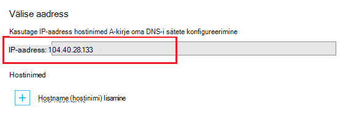

Leidke ressursid Internetis kasutatakse Domain Name System (DNS). Näiteks kui sisestate rakenduse veebiaadressi brauseris, või klõpsake veebilehe lingi, kasutab DNS-i domeeni tõlkida IP-aadress. IP-aadress on omamoodi nagu füüsilise asukoha aadressi, kuid see ei ole väga inimeste sõbralik. Näiteks, on märksa lihtsam DNS-i nimi, nt **contoso.com** meeles pidada, kui see on meeles pidada, nt 192.168.1.88 või 2001:0:4137:1f67:24a2:3888:9cce:fea3 IP-aadress.

DNS-i süsteemis põhineb *kirjed*. Kirjete teatud *nimi*, nt **contoso.com**, seostada teise DNS-i nimi või IP-aadress. Kui rakendus, näiteks veebibrauser, otsib DNS-i nimi, leiab kirje ja kasutab iganes osutab aadressina. Kui see osutab väärtus on IP-aadress, brauseri kasutab seda väärtust. Kui see osutab teise DNS-i nimi, siis taotlus on eraldusvõime uuesti teha. Kokkuvõttes kõik nimelahendus lõpeb IP-aadress.

Kui loote web app rakenduse teenus, DNS-i nimi määratakse automaatselt web appi. Sellise nimega vormis ** &lt;yourwebappname&gt;. azurewebsites.net**. On ka virtuaalse IP-aadressi kasutamiseks saadaval kui loomise DNS-i kirjeid nii, et saate luua kirjed, mis viitavad soovitud **. azurewebsites.net**, või osutate IP-aadress.

> [AZURE.NOTE] Kui kustutamine ja looge oma veebirakenduse või muuta rakenduse teenuse leping režiimi **tasuta** pärast **tavaline**, **ühiskasutuses**või **Standard**seatud, muudab oma veebirakenduse IP-aadress.

On ka mitut tüüpi kirjeid, igal versioonil oma funktsioonid ja piirangud, kuid veebirakendustes ainult teeme kahe, *A* ja *CNAME* -kirje kohta.

###Aadress (kirje)

A-kirje kaartide domeeni, nt **contoso.com** või **www.contoso.com**, *või metamärkide domeeni* nagu ** \*. contoso.com**, IP-aadressi. Puhul on web app rakenduse teenuse teenuse virtuaalse IP- või teatud IP aadress mille ostetud veebirakenduse jaoks.

A-kirje CNAME-kirje üle peamisi eeliseid on:

* Saate vastendada juurdomeeni, nt **contoso.com** IP-aadress; mitme registraatorit lubada ainult kirjete kasutamine

* Saate määrata ühe kirje, mis kasutab metamärke, näiteks ** \*. contoso.com**, mis käsitleks taotlused mitme alamdomeenide, nt **mail.contoso.com**, **blogs.contoso.com**või **www.contso.com**.

> [AZURE.NOTE] Kuna A-kirje on vastendatud staatiline IP-aadress, ei saa automaatselt lahendada muudatused oma veebirakenduse IP-aadress. IP-aadress soovitud kirjete jaoks on esitatud kui oma veebirakenduse; kohandatud domeeni nime sätete konfigureerimine selle väärtuse muutuda siis, kui kustutamine ja looge oma veebirakenduse või muuta tagasi **tasuta**rakenduse teenuse leping režiimi.

###Alias record (CNAME-kirje)

CNAME-kirje kaardid *teatud* DNS-i nimi, nt **mail.contoso.com** või **www.contoso.com**, mõne muu (kanoonilise) domeeni nimi. Rakenduse teenuse veebirakenduste puhul on kanoonilise domeeninimi on ** &lt;yourwebappname >. azurewebsites.net** domeeninime oma veebirakenduse. Kui loodud, loob CNAME alias on ** &lt;yourwebappname >. azurewebsites.net** domeeni nimi. CNAME-kirje on IP-aadressi lahendamiseks oma ** &lt;yourwebappname >. azurewebsites.net** domeeninime automaatselt, et kui veebirakenduse IP-aadress muutub, te ei pea vastu võtta.

> [AZURE.NOTE] Mõned domeeniregistraatori võimaldavad ainult vastendamine alamdomeene kasutamisel CNAME-kirje (nt **www.contoso.com**) ja mitte juurkausta nimed, nt **contoso.com**. CNAME-kirje kohta lisateabe saamiseks dokumentatsioonist oma domeeniregistraatori, <a href="http://en.wikipedia.org/wiki/CNAME_record">Wikipedia kirje CNAME-kirje</a>või dokumendi <a href="http://tools.ietf.org/html/rfc1035">IETF domeeninimede - rakendamise ja määratlus</a> .

###Web Appi DNS-i üksikasjad

A-kirje kasutamine veebirakenduste jaoks on vaja esmalt looma ühte järgmistest TXT-kirjed:

* **Et juurdomeeni** – A DNS-i TXT-kirje, **@** et ** &lt;yourwebappname&gt;. azurewebsites.net**.

* **Teatud alamdomeeni jaoks** – A DNS-i nimi ** &lt;alamdomeeni >** et ** &lt;yourwebappname&gt;. azurewebsites.net**. Näiteks **ajaveebide** kui A-kirje on loodud **blogs.contoso.com**.

* **Metamärkide sub-dodmains jaoks** – A DNS-i TXT-kirje, *** abil ** &lt;yourwebappname&gt;. azurewebsites.net**.

TXT-kirje kasutatakse proovite kasutada domeeni omandiõiguse kinnitamiseks. See on lisaks A-kirje, mis osutab virtuaalse IP-aadressi oma veebirakenduse loomine.

Võite leida IP-aadress ja **. azurewebsites.net** nimede oma veebirakenduse, tehes järgmist:

1. Avage brauseris [Azure portaali](https://portal.azure.com).

2. **Veebirakenduste** tera, klõpsake oma veebirakenduse nime ja valige lehe allosas **kohandatud domeene** .

    

3. **Kohandatud domeenide** tera, kuvatakse virtuaalse IP-aadress. Selle teabe salvestada, kui seda kasutatakse DNS-i kirjete loomisel

    

    > [AZURE.NOTE] Ei saa kasutada kohandatud domeeninime **tasuta** web app ja peab versioonile rakenduse teenusleping **ühiskasutuses**, **Basic**, **Standard**või **Premium** taseme. Lisateavet rakenduse teenusleping hinnad astme, sh kuidas muuta oma veebirakenduse hinnakirjad taseme kohta leiate teemast [veebirakenduste skaala](../articles/web-sites-scale.md).
