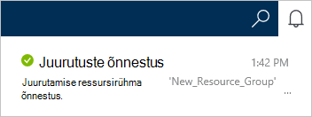
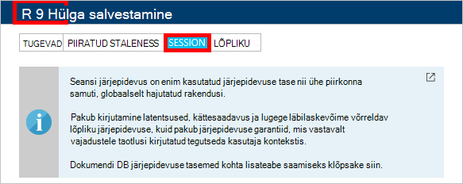

1.  [Azure'i portaali](https://portal.azure.com/)sisse logida.
2.  Jumpbar, klõpsake nuppu **Uus**, klõpsake **andmete + salvestusruumi**ja klõpsake **DocumentDB (NoSQL)**.

      

3. **Uue konto** tera, määrake soovitud konfiguratsiooni DocumentDB konto.

    

    - Sisestage väljale **ID** tuvastamiseks DocumentDB konto nimi.  Kui **ID** on kinnitatud, kuvatakse väljal **ID** roheline märge. **ID** väärtus muutub hostinimi URI sees. **ID** võivad sisaldada ainult väiketähed, arve, ja "-" märkide ja peab olema 3 – 50 märki. Pange tähele, et *documents.azure.com* on lisatud lõpp-punkti nimi valimist tulem DocumentDB konto lõpp-punkti.

    - Valige väljal **NoSQL API** **DocumentDB**.  

    - Valige **tellimus**, Azure'i tellimus, mida soovite kasutada konto DocumentDB. Kui teie konto on ainult üks tellimus, on vaikimisi valitud konto.

    - **Ressursirühm**valige või looge konto DocumentDB ressursirühma.  Vaikimisi on loodud uue ressursirühma. Lisateabe saamiseks lugege teemat [Azure portaalis hallata oma Azure ressursse](../articles/azure-portal/resource-group-portal.md).

    - **Asukoht** abil saate määrata geograafiline asukoht, kus majutada DocumentDB kontole. 

4.  Pärast uue DocumentDB Kontosuvandid on konfigureeritud, klõpsake nuppu **Loo**. Juurutamise oleku, märkige ruut jaoturi teatised.  

      

    

5.  Pärast DocumentDB konto on loodud, on kasutamiseks valmis vaikesätted. Vaikimisi järjepidevuse DocumentDB konto on seatud **seanss**.  Saate reguleerida, klõpsates menüüs ressursi **Vaikimisi järjepidevuse** vaikimisi järjepidevuse. Pakutud DocumentDB järjepidevuse tasemete kohta leiate lisateavet teemast [järjepidevuse tasemete DocumentDB](../articles/documentdb/documentdb-consistency-levels.md).

      

      

[How to: Create a DocumentDB account]: #Howto
[Next steps]: #NextSteps
[documentdb-manage]:../articles/documentdb/documentdb-manage.md
