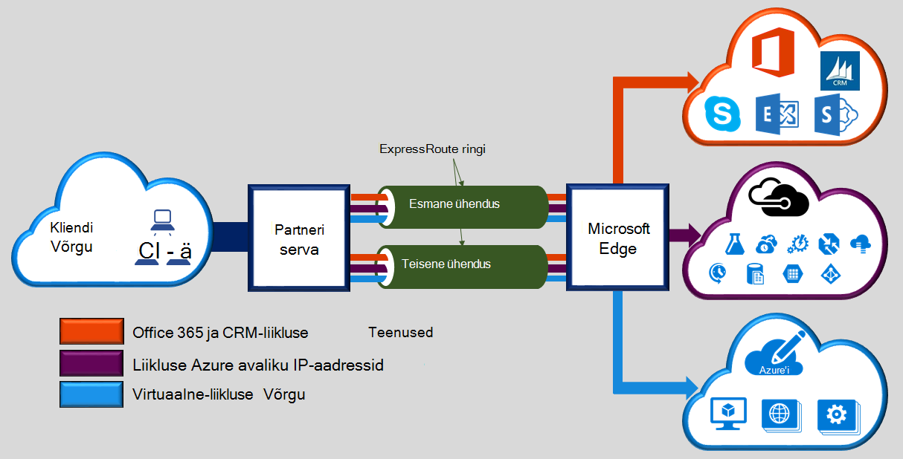

Microsoft Azure'i ExpressRoute võimaldab laiendada oma kohapealse võrgu Microsofti pilveteenuse hõlbustav ühenduvuse pakkuja sihtotstarbeline privaatne ühenduse kaudu. ExpressRoute, kus saate luua ühenduse Microsofti pilveteenustega, nt Microsoft Azure'i, Office 365 ja CRM Online'i. Ühenduvus võib olla ka kõik mis (IP VPN) võrgu, kakspunkt Ethernet võrgus või virtuaalse rist-ühenduse kaudu ühenduvus pakkuja saanud poole. Avaliku Interneti kaudu ei lähe ExpressRoute ühendused. See võimaldab ExpressRoute ühendused pakkuda töökindlust, kiirem kiiruse, lower latentsused ja suurem turvalisus, kui tüüpilised ühendused Interneti kaudu.  

